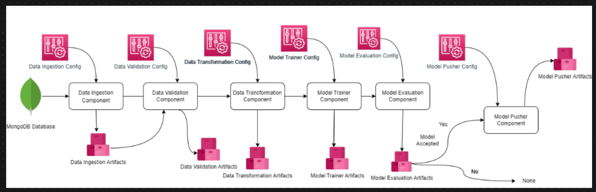
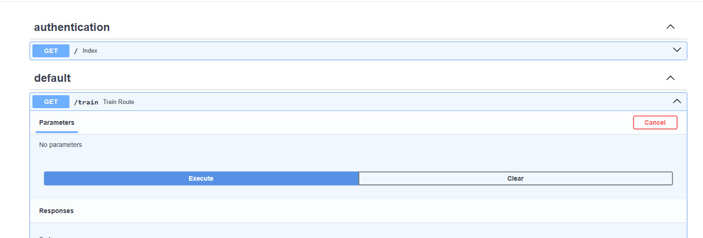

# Network Security
This is my End to End Network Security Project with MLOps and ETL pipelines. The aim of project is to detect phishing using Machine Learning.
I use modular coding and Object-Oriented Programming in Python. 
List of tools/libraries/frameworks used: Sklearn, Numpy, Pandas, MLFlow, AWS (S3, EC2, ECR), Github Actions CI/CD Pipeline, MongoDB, FAST API,  Docker

## Project structure 

<!--  -->
Data Ingestion Component ->  Data Validation Component -> Data Transformation Component -> Model Training Component ->  Model Evaluation Component -> Model Pusher Component

I will use MongoDB Database for this project. 


## The order of creating files/directories

Conda
```
conda init
conda create --prefix ./venv python=3.12
conda activate venv/
```

Create the project structure

Fill in requirements.txt

Create logging and exception handling

Create MongoDB Atlas cluster, create a user and test connection

Create ETL pipeline (push_data.py)


### ETL pipeline (Extract, Transform, Load)

My data source is a CSV file

Transformation
* basic preprocessing
* cleaning raw data
* converting to json

Then the Json file is stored in MongoDB Atlas.

Create training pipeline and add the following steps to that:

## Data Ingestion Architecture

Data Ingestion Config -> Initiate Data Ingestion -> Export raw Data from MongoDB to Feature Store -> Drop unnecassary Columns  and do Feature Engineering -> Split data into train and test -> Data Ingestion Artifact(output) to Feature Store

## Data Validation Architecture

At this stage we need to ensure that our data has the same schema, and we don't have data drift (distribution, etc has not changed)

Data Validation Config -> Initiate Data Validation -> Read Data -> Validate number of Columns -> do numerical columns exist?


## Data Transformation Architecture

Prerocessing data to Replace NAN values, Scale input

## Model Training and Evaluation Architecture

Model trainer config , Data Transformation Artifacts -> Initiate Model Training -> Load numpy array data -> Split train and test-> Model factory -> get best model -> Model sensor -> calculate metric -> Model Trainer Artifact (model.pkl file)

## MLflow
Add mlflow tracking to code and use DAGsHub to connect to this repository. In the repo at DagsHub, choose remote -> experiments and copy the code. Add the code to model training file. Then the local mlflow will not be created. Instead they will go to dagshub experiments.

add app.py file which is the frontand and will trigger the pipeline


```
uvicorn app:app --reload
```





## Cloudify: Step 1. Move artifacts to S3 bucket

```
curl "https://awscli.amazonaws.com/awscli-exe-linux-x86_64.zip" -o "awscliv2.zip"
unzip awscliv2.zip
sudo ./aws/install

```

Create IAM user on AWS with -> attach policies directly ->add  permission AdministratorAccess -> create user

users -> select the user -> access keys -> create Access Key -> command line interface -> Create Access key

in the terminal write
aws configure
then pass the newly generated aws access key

Create an S3 bucket


## Cloudify: Step 2. Store docker image in AWS ECR

Create ECR (Elastic Contrainer Registry) repository which is a fully-managed docker registry. Then copy the URI next to repository name and add it as a secret to github actions.

## Cloudify: Step 3. Deploying the docker image in AWS EC2
Add a job to CI/CD pipeline for deployment
Create an EC2 instance and allow HTTPS and HTTP to that from the internet. When the instance is created, click on it and choose connect and use default settings.

Then in Security, go to security groups -> edit inbound rules -> Add rule -> Custom TCP, port 8080 (to expose the container port), anywhere IPv4. then from the EC2 instance, copy the Public IPv4 address and call that with port 8080 in a browser

Execute these commands in EC2 terminal to setup docker
```
sudo apt-get update -y
sudo apt-get upgrade

curl -fsSL https://get.docker.com -o get-docker.sh
sudo sh get-docker.sh
sudo usermod -aG docker ubuntu
newgrp docker
```

Then in Github repo go to Settings -> Actions -> Runners -> New self-hosted runner
Choose linux and run the commands in EC2 terminal

At somepoint you are prompted to enter a group name, enter to choose default, then there is a prompt to pick a name for runner, choose self-hosted

After executing ```./run.sh``` on scree it will be written Listening for jobs. and in Github we can see the newly added runner under Runners

Then push the changes. After CI/CD is done, on EC2 we see 2025-03-19 08:11:01Z: Job Continuous-Deployment completed with result: Succeeded